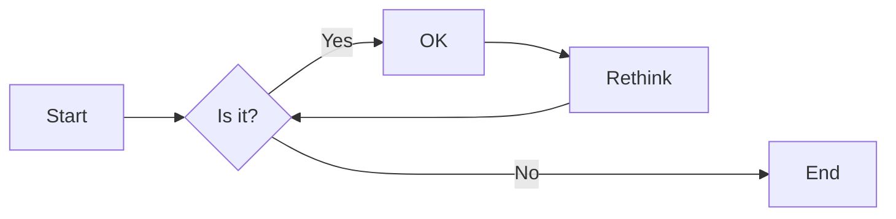
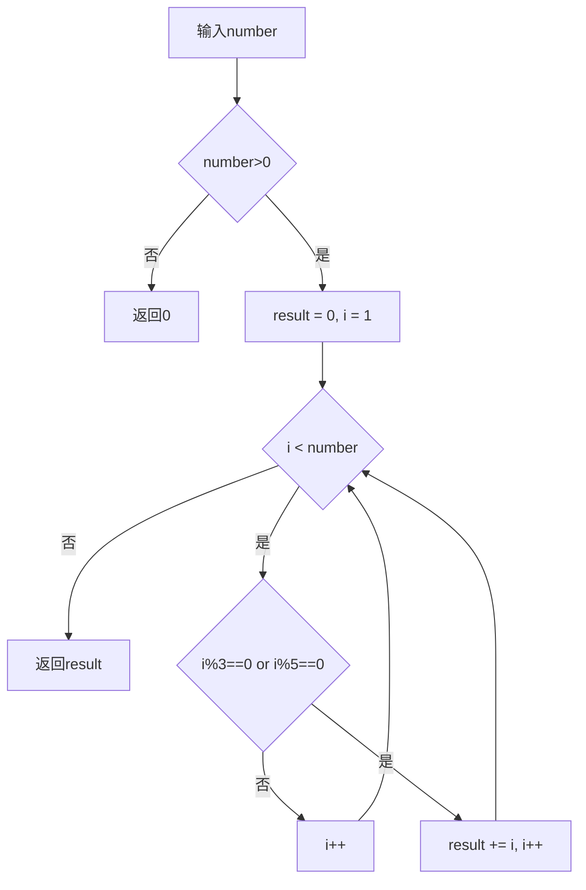

# 实验三 Python列表

班级： 21计科03

学号：B20210302317

姓名： 覃思敏

Github地址：<https://github.com/xx12qq/Experiment.git>

CodeWars地址：<https://www.codewars.com/users/xx12qq>

---

## 实验目的

1. 学习Python的简单使用和列表操作
2. 学习Python中的if语句

## 实验环境

1. Git
2. Python 3.10
3. VSCode
4. VSCode插件

## 实验内容和步骤

### 第一部分

Python列表操作

完成教材《Python编程从入门到实践》下列章节的练习：

- 第3章 列表简介
- 第4章 操作列表
- 第5章 if语句

- ## 练习 3.1 姓名

```bash
names.py
names = ['ron', 'tyler', 'dani']
print(names[0])
print(names[1])
print(names[2])
输出：
ron
tyler
dani
``````
练习 3.2 问候语
```bash
greetings.py
names = ['ron', 'tyler', 'dani']
msg = f"Hello, {names[0].title()}!"
print(msg)
msg = f"Hello, {names[1].title()}!"
print(msg)
msg = f"Hello, {names[2].title()}!"
print(msg)
输出：
Hello, Ron!
Hello, Tyler!
Hello, Dani!
```

练习 3.4 嘉宾名单
```bash
guest_list.py
guests = ['guido van rossum', 'jack turner', 'lynn hill']
name = guests[0].title()
print(f"{name}, please come to dinner.")
name = guests[1].title()
print(f"{name}, please come to dinner.")
name = guests[2].title()
print(f"{name}, please come to dinner.")
输出：
Guido Van Rossum, please come to dinner.
Jack Turner, please come to dinner.
Lynn Hill, please come to dinner.
``````

练习 3.5 修改嘉宾名单
```bash
changing_guest_list.py
# 邀请一些嘉宾与你共进晚餐
guests = ['guido van rossum', 'jack turner', 'lynn hill']
name = guests[0].title()
print(f"{name}, please come to dinner.")
name = guests[1].title()
print(f"{name}, please come to dinner.")
name = guests[2].title()
print(f"{name}, please come to dinner.")
name = guests[1].title()
print(f"\nSorry, {name} can't make it to dinner.")
# Jack 无法赴约，转而邀请 Gary
del(guests[1])
guests.insert(1, 'gary snyder')
# 重新打印邀请函
name = guests[0].title()
print(f"\n{name}, please come to dinner.")
name = guests[1].title()
print(f"{name}, please come to dinner.")
name = guests[2].title()
print(f"{name}, please come to dinner.")

输出：
Guido Van Rossum, please come to dinner.
Jack Turner, please come to dinner.
Lynn Hill, please come to dinner.
Sorry, Jack Turner can't make it to dinner.
Guido Van Rossum, please come to dinner.
Gary Snyder, please come to dinner.
Lynn Hill, please come to dinner.
``````
练习 3.6 添加嘉宾
```bash
more_guests.py
# 邀请一些嘉宾与你共进晚餐
guests = ['guido van rossum', 'jack turner', 'lynn hill']
name = guests[0].title()
print(f"{name}, please come to dinner.")
name = guests[1].title()
print(f"{name}, please come to dinner.")
name = guests[2].title()
print(f"{name}, please come to dinner.")
name = guests[1].title()
print(f"\nSorry, {name} can't make it to dinner.")
# Jack 无法赴约，转而邀请 Gary
del(guests[1])
·8·
练习答案
guests.insert(1, 'gary snyder')
# 重新打印邀请函
name = guests[0].title()
print(f"\n{name}, please come to dinner.")
name = guests[1].title()
print(f"{name}, please come to dinner.")
name = guests[2].title()
print(f"{name}, please come to dinner.")
# 找到了更大的餐桌，再邀请一些嘉宾
print("\nWe got a bigger table!")
guests.insert(0, 'frida kahlo')
guests.insert(2, 'reinhold messner')
guests.append('elizabeth peratrovich')
name = guests[0].title()
print(f"{name}, please come to dinner.")
name = guests[1].title()
print(f"{name}, please come to dinner.")
name = guests[2].title()
print(f"{name}, please come to dinner.")
name = guests[3].title()
print(f"{name}, please come to dinner.")
name = guests[4].title()
print(f"{name}, please come to dinner.")
name = guests[5].title()
print(f"{name}, please come to dinner.")
输出：
Guido Van Rossum, please come to dinner.
Jack Turner, please come to dinner.
Lynn Hill, please come to dinner.
Sorry, Jack Turner can't make it to dinner.
Guido Van Rossum, please come to dinner.
Gary Snyder, please come to dinner.
Lynn Hill, please come to dinner.
We got a bigger table!
Frida Kahlo, please come to dinner.
Guido Van Rossum, please come to dinner.
Reinhold Messner, please come to dinner.
Gary Snyder, please come to dinner.
Lynn Hill, please come to dinner.
Elizabeth Peratrovich, please come to dinner.
``````
练习 3.7 缩短名单
```bash
shrinking_guest_list.py
# 邀请一些嘉宾与你共进晚餐
guests = ['guido van rossum', 'jack turner', 'lynn hill']
name = guests[0].title()
print(f"{name}, please come to dinner.")
name = guests[1].title()
print(f"{name}, please come to dinner.")
name = guests[2].title()
·10·
练习答案
print(f"{name}, please come to dinner.")
name = guests[1].title()
print(f"\nSorry, {name} can't make it to dinner.")
# Jack 无法赴约，转而邀请 Gary
del(guests[1])
guests.insert(1, 'gary snyder')
# 重新打印邀请函
name = guests[0].title()
print(f"\n{name}, please come to dinner.")
name = guests[1].title()
print(f"{name}, please come to dinner.")
name = guests[2].title()
print(f"{name}, please come to dinner.")
# 找到了更大的餐桌，再邀请一些嘉宾
print("\nWe got a bigger table!")
guests.insert(0, 'frida kahlo')
guests.insert(2, 'reinhold messner')
guests.append('elizabeth peratrovich')
name = guests[0].title()
print(f"{name}, please come to dinner.")
name = guests[1].title()
print(f"{name}, please come to dinner.")
name = guests[2].title()
print(f"{name}, please come to dinner.")
name = guests[3].title()
print(f"{name}, please come to dinner.")
name = guests[4].title()
print(f"{name}, please come to dinner.")
name = guests[5].title()
print(f"{name}, please come to dinner.")
# 糟糕，餐桌无法及时送达！
print("\nSorry, we can only invite two people to dinner.")
name = guests.pop()
print(f"Sorry, {name.title()} there's no room at the table.")
name = guests.pop()
print(f"Sorry, {name.title()} there's no room at the table.")
name = guests.pop()
print(f"Sorry, {name.title()} there's no room at the table.")
name = guests.pop()
print(f"Sorry, {name.title()} there's no room at the table.")
# 应该只剩下两位嘉宾了，向他们发出邀请
name = guests[0].title()
print(f"{name}, please come to dinner.")
name = guests[1].title()
print(f"{name}, please come to dinner.")
# 清空名单
del(guests[0])
del(guests[0])
# 核实名单是空的
print(guests)
输出：
Guido Van Rossum, please come to dinner.
Jack Turner, please come to dinner.
Lynn Hill, please come to dinner.
Sorry, Jack Turner can't make it to dinner.
Guido Van Rossum, please come to dinner.
Gary Snyder, please come to dinner.
Lynn Hill, please come to dinner.
We got a bigger table!
Frida Kahlo, please come to dinner.
Guido Van Rossum, please come to dinner.
Reinhold Messner, please come to dinner.
Gary Snyder, please come to dinner.
Lynn Hill, please come to dinner.
Elizabeth Peratrovich, please come to dinner.
Sorry, we can only invite two people to dinner.
Sorry, Elizabeth Peratrovich there's no room at the table.
Sorry, Lynn Hill there's no room at the table.
Sorry, Gary Snyder there's no room at the table.
Sorry, Reinhold Messner there's no room at the table.
Frida Kahlo, please come to dinner.
Guido Van Rossum, please come to dinner.
``````
练习 3.8 放眼世界
```bash
seeing_the_world.py
locations = ['himalaya', 'andes', 'tierra del fuego', 'labrador', 'guam']
print("Original order:")
print(locations)
print("\nAlphabetical:")
print(sorted(locations))
print("\nOriginal order:")
print(locations)
print("\nReverse alphabetical:")
print(sorted(locations, reverse=True))
print("\nOriginal order:")
print(locations)
print("\nReversed:")
locations.reverse()
print(locations)
print("\nOriginal order:")
locations.reverse()
print(locations)
print("\nAlphabetical")
locations.sort()
print(locations)
print("\nReverse alphabetical")
locations.sort(reverse=True)
print(locations)
输出：
Original order:
['himalaya', 'andes', 'tierra del fuego', 'labrador', 'guam']
Alphabetical:
['andes', 'guam', 'himalaya', 'labrador', 'tierra del fuego']
Original order:
['himalaya', 'andes', 'tierra del fuego', 'labrador', 'guam']
Reverse alphabetical:
['tierra del fuego', 'labrador', 'himalaya', 'guam', 'andes']
Original order:
['himalaya', 'andes', 'tierra del fuego', 'labrador', 'guam']
Reversed:
['guam', 'labrador', 'tierra del fuego', 'andes', 'himalaya']
Original order:
['himalaya', 'andes', 'tierra del fuego', 'labrador', 'guam']
Alphabetical
['andes', 'guam', 'himalaya', 'labrador', 'tierra del fuego']
Reverse alphabetical
['tierra del fuego', 'labrador', 'himalaya', 'guam', 'andes']
``````
第 4 章
练习 4.1 比萨
``````bash
pizzas.py
favorite_pizzas = ['pepperoni', 'hawaiian', 'veggie']
# 打印所有比萨的名称
for pizza in favorite_pizzas:
 print(pizza)
print("\n")
# 针对每种比萨打印一个句子
for pizza in favorite_pizzas:
 print(f"I really love {pizza} pizza!")
print("\nI really love pizza!")
输出：
pepperoni
hawaiian
veggie
I really love pepperoni pizza!
I really love hawaiian pizza!
I really love veggie pizza!
I really love pizza!
``````
练习 4.2 动物
```bash
animals.py
animals = ["spider monkey", "lemur", "giraffe"]
# 打印每种动物
for animal in animals:
 print(animal)
print("\n")
# 针对每种动物打印一个句子
for animal in animals:
 print(f"A {animal} has a long tail.")
print("\nAll of these animals have long tails.")
输出：
spider monkey
lemur
giraffe
A spider monkey has a long tail.
A lemur has a long tail.
A giraffe has a long tail.
All of these animals have long tails.
``````
练习 4.3 数到 20
```bash
counting_to_twenty.py
numbers = list(range(1, 21))
for number in numbers:
 print(number)
输出：
1
2
3
...
18
19
20
``````
练习 4.5 100 万求和
```bash
summing_a_million.py
numbers = list(range(1, 1_000_001))
print(min(numbers))
print(max(numbers))
print(sum(numbers))
输出：
1
1000000
500000500000
``````
练习 4.6 奇数
``````bash
odd_numbers.py
odd_numbers = list(range(1, 20, 2))
for number in odd_numbers:
 print(number)
输出：
1
3
5
...
15
17
19
``````
练习 4.7   
```bash
threes.py
threes = list(range(3, 31, 3))
for number in threes:
 print(number)
输出：
3
6
9
...
24
27
30
``````
练习 4.8 立方
```bash
cubes.py
cubes = []
for number in range(1, 11):
 cube = number**3
 cubes.append(cube)
for cube in cubes:
 print(cube)
输出：
1
8
27
...
512
729
1000
``````
练习 4.9 立方推导式
```bash
cube_comprehension.py
cubes = [number**3 for number in range(1,11)]
for cube in cubes:
 print(cube)
输出：
1
8
27
...
512
729
1000
``````
练习 4.11 你的比萨，我的比萨
``````bash
my_pizzas_your_pizzas.py
favorite_pizzas = ['pepperoni', 'hawaiian', 'veggie']
friend_pizzas = favorite_pizzas[:]
favorite_pizzas.append("meat lover's")
friend_pizzas.append('pesto')
print("My favorite pizzas are:")
for pizza in favorite_pizzas:
 print(f"- {pizza}")
print("\nMy friend's favorite pizzas are:")
for pizza in friend_pizzas:
 print(f"- {pizza}")
输出：
My favorite pizzas are:
- pepperoni
- hawaiian
- veggie
- meat lover's
My friend's favorite pizzas are:
- pepperoni
- hawaiian
- veggie
- pesto
``````
练习 4.12 使用多个循环
```bash
more_loops.py
my_foods = ['pizza', 'falafel', 'carrot cake']
friend_foods = my_foods[:]
my_foods.append('cannoli')
friend_foods.append('ice cream')
print("My favorite foods are:")
for food in my_foods:
 print(f"- {food}")
print("\nMy friend's favorite foods are:")
for food in friend_foods:
 print(f"- {food}")
输出：
·21·
Python 编程：从入门到实践（第３版）
My favorite foods are:
- pizza
- falafel
- carrot cake
- cannoli
My friend's favorite foods are:
- pizza
- falafel
- carrot cake
- ice cream
``````
练习 4.13 自助餐
```bash
buffet.py
menu_items = (
 'rockfish sandwich', 'halibut nuggets', 'smoked salmon chowder',
 'salmon burger', 'crab cakes',
 )
print("You can choose from the following menu items:")
for item in menu_items:
 print(f"- {item}")
menu_items = (
 'rockfish sandwich', 'halibut nuggets', 'smoked salmon chowder',
 'black cod tips', 'king crab legs',
 )
print("\nOur menu has been updated.")
print("You can now choose from the following items:")
for item in menu_items:
 print(f"- {item}")
输出：
You can choose from the following menu items:
- rockfish sandwich
- halibut nuggets
- smoked salmon chowder
- salmon burger
- crab cakes
Our menu has been updated.
You can now choose from the following items:
- rockfish sandwich
- halibut nuggets
- smoked salmon chowder
- black cod tips
- king crab legs
``````
第 5 章
练习 5.3 外星人颜色 1
```bash
能够通过测试的版本：
alien_colors_1.py
alien_color = 'green'
if alien_color == 'green':
 print("You just earned 5 points!")
输出：
You just earned 5 points!
不能通过测试的版本：
alien_colors_1_fail.py
alien_color = 'red'
if alien_color == 'green':
 print("You just earned 5 points!")
这个版本没有输出。
``````
练习 5.4 外星人颜色 2
```bash
执行 if 代码块的版本：
alien_colors_2_if_block.py
alien_color = 'green'
if alien_color == 'green':
 print("You just earned 5 points!")
else:
 print("You just earned 10 points!")
输出：
You just earned 5 points!
执行 else 代码块的版本：
alien_colors_2_else_block.py
alien_color = 'yellow'
if alien_color == 'green':
 print("You just earned 5 points!")
else:
 print("You just earned 10 points!")
输出：
You just earned 10 points!
``````
练习 5.5 外星人颜色 3
```bash
alien_colors_3.py
alien_color = 'red'
if alien_color == 'green':
 print("You just earned 5 points!")
elif alien_color == 'yellow':
 print("You just earned 10 points!")
else:
 print("You just earned 15 points!")
外星人为红色时的输出：
You just earned 15 points!
``````
练习 5.6 人生的不同阶段
```bash
stages_of_life.py
age = 17
if age < 2:
 print("You're a baby!")
elif age < 4:
 print("You're a toddler!")
elif age < 13:
 print("You're a kid!")
elif age < 18:
 print("You're a teenager!")
elif age < 65:
 print("You're an adult!")
else:
 print("You're an elder!")
输出：
You're a teenager!
``````
练习 5.7 喜欢的水果
```bash
favorite_fruits.py
favorite_fruits = ['blueberries', 'salmonberries', 'peaches']
if 'bananas' in favorite_fruits:
 print("You really like bananas!")
if 'apples' in favorite_fruits:
 print("You really like apples!")
if 'blueberries' in favorite_fruits:
 print("You really like blueberries!")
if 'kiwis' in favorite_fruits:
 print("You really like kiwis!")
if 'peaches' in favorite_fruits:
 print("You really like peaches!")
输出：
You really like blueberries!
You really like peaches!
``````
练习 5.8 以特殊方式跟管理员打招呼
```bash
hello_admin.py
usernames = ['eric', 'willie', 'admin', 'erin', 'ever']
for username in usernames:
 if username == 'admin':
 print("Hello admin, would you like to see a status report?")
 else:
 print(f"Hello {username}, thank you for loggin in again!")
输出：
Hello eric, thank you for logging in again!
Hello willie, thank you for logging in again!
Hello admin, would you like to see a status report?
Hello erin, thank you for logging in again!
Hello ever, thank you for logging in again!
``````
练习 5.9 处理没有用户的情形
```bash
no_users.py
usernames = []
if usernames:
 for username in usernames:
 if username == 'admin':
 print("Hello admin, would you like to see a status report?")
 else:
 print(f"Hello {username}, thank you for loggin in again!")
else:
 print("We need to find some users!")
输出：
We need to find some users!
``````
练习 5.10 检查用户名
```bash
checking_usernames.py
current_users = ['eric', 'willie', 'admin', 'erin', 'Ever']
new_users = ['sarah', 'Willie', 'PHIL', 'ever', 'Iona']
current_users_lower = [user.lower() for user in current_users]
for new_user in new_users:
 if new_user.lower() in current_users_lower:
 print(f"Sorry {new_user}, that name is taken.")
 else:
 print(f"Great, {new_user} is still available.")
输出：
Great, sarah is still available.
Sorry Willie, that name is taken.
Great, PHIL is still available.
Sorry ever, that name is taken.
Great, Iona is still available.
注意：如果你还不熟悉列表解析，可像下面这样使用循环来生成列表current_users_lower。
current_users_lower = []
for user in current_users:
 current_users_lower.append(user.lower())
 ``````


###  第二部分

在[Codewars网站](https://www.codewars.com)注册账号，完成下列Kata挑战：

---

#### 第一题：3和5的倍数（Multiples of 3 or 5）

难度： 6kyu

如果我们列出所有低于 10 的 3 或 5 倍数的自然数，我们得到 3、5、6 和 9。这些数的总和为 23. 完成一个函数，使其返回小于某个整数的所有是3 或 5 的倍数的数的总和。此外，如果数字为负数，则返回 0。

注意：如果一个数同时是3和5的倍数，应该只被算一次。

**提示：首先使用列表解析得到一个列表，元素全部是3或者5的倍数。
使用sum函数可以获取这个列表所有元素的和.**

代码提交地址：
<https://www.codewars.com/kata/514b92a657cdc65150000006>

```bash 
 def solution(number):
    if number < 0:
        return 0

    multiples = set()

    for i in range(3, number):
        if i % 3 == 0 or i % 5 == 0:
            multiples.add(i)

    return sum(multiples)

 示例使用：
result = solution(10)
print(result)  # 输出：23

```
#### 第二题： 重复字符的编码器（Duplicate Encoder）

难度： 6kyu

本练习的目的是将一个字符串转换为一个新的字符串，如果新字符串中的每个字符在原字符串中只出现一次，则为"("，如果该字符在原字符串中出现多次，则为")"。在判断一个字符是否是重复的时候，请忽略大写字母。

例如:

```python
"din"      =>  "((("
"recede"   =>  "()()()"
"Success"  =>  ")())())"
"(( @"     =>  "))(("
```

代码提交地址:
<https://www.codewars.com/kata/54b42f9314d9229fd6000d9c>

```bash
def duplicate_encode(word):
    word = word.lower()  # 将所有字符转换为小写以忽略大小写
    result = ''

    for char in word:
        if word.count(char) > 1:
            result += ')'
        else:
            result += '('

    return result

# 示例使用：
print(duplicate_encode("din"))      # 输出：(((
print(duplicate_encode("recede"))   # 输出：()()()
print(duplicate_encode("Success"))  # 输出：)())())"
print(duplicate_encode("(( @"))     # 输出：))((

``````
#### 第三题：括号匹配（Valid Braces）

难度：6kyu

写一个函数，接收一串括号，并确定括号的顺序是否有效。如果字符串是有效的，它应该返回True，如果是无效的，它应该返回False。
例如：

```python
"(){}[]" => True 
"([{}])" => True
 "(}" => False
 "[(])" => False 
"[({})](]" => False
```

**提示：
python中没有内置堆栈数据结构，可以直接使用`list`来作为堆栈，其中`append`方法用于入栈，`pop`方法可以出栈。**

代码提交地址
<https://www.codewars.com/kata/5277c8a221e209d3f6000b56>

```bash
def valid_braces(string):
    stack = []
    mapping = {')': '(', '}': '{', ']': '['}

    for char in string:
        if char in '({[':
            stack.append(char)
        elif char in ')}]':
            if not stack or stack[-1] != mapping[char]:
                return False
            stack.pop()

    return not stack

# 示例使用：
print(valid_braces("(){}[]"))   # 输出：True
print(valid_braces("([{}])"))   # 输出：True
print(valid_braces("(}"))       # 输出：False
print(valid_braces("[(])"))     # 输出：False
print(valid_braces("[({})](]")) # 输出：False
``````

#### 第四题： 从随机三元组中恢复秘密字符串(Recover a secret string from random triplets)

难度： 4kyu

有一个不为你所知的秘密字符串。给出一个随机三个字母的组合的集合，恢复原来的字符串。

这里的三个字母的组合被定义为三个字母的序列，每个字母在给定的字符串中出现在下一个字母之前。"whi "是字符串 "whatisup "的一个三个字母的组合。

作为一种简化，你可以假设没有一个字母在秘密字符串中出现超过一次。

对于给你的三个字母的组合，除了它们是有效的三个字母的组合以及它们包含足够的信息来推导出原始字符串之外，你可以不做任何假设。特别是，这意味着秘密字符串永远不会包含不出现在给你的三个字母的组合中的字母。

测试用例：

```python
secret = "whatisup"
triplets = [
  ['t','u','p'],
  ['w','h','i'],
  ['t','s','u'],
  ['a','t','s'],
  ['h','a','p'],
  ['t','i','s'],
  ['w','h','s']
]
test.assert_equals(recoverSecret(triplets), secret)
```

代码提交地址：
<https://www.codewars.com/kata/53f40dff5f9d31b813000774/train/python>

提示：

- 利用集合去掉`triplets`中的重复字母，得到字母集合`letters`，最后的`secret`应该由集合中的字母组成，`secret`长度也等于该集合。

```python
letters = {letter for triplet in triplets for letter in triplet }
length = len(letters)
```

- 创建函数`check_first_letter(triplets, first_letter)`，检测一个字母是不是secret的首字母，返回True或者False。
- 创建函数`remove_first_letter(triplets, first_letter)`,  从三元组中去掉首字母，返回新的三元组。
- 遍历字母集合letters，利用上面2个函数得到最后的结果`secret`。
```bash
def recoverSecret(triplets):
    # 构建图的邻接列表
    graph = {}
    for triplet in triplets:
        for char in triplet:
            if char not in graph:
                graph[char] = set()
    
    for triplet in triplets:
        graph[triplet[0]].add(triplet[1])
        graph[triplet[1]].add(triplet[2])

    # 进行拓扑排序
    visited = set()
    result = []

    def dfs(node):
        if node not in visited:
            visited.add(node)
            for neighbor in graph[node]:
                dfs(neighbor)
            result.append(node)

    for node in graph:
        dfs(node)

    return ''.join(result[::-1])

# 示例使用：
triplets = [['t', 'u', 'p'], ['w', 'h', 'i'], ['t', 's', 'u'], ['a', 't', 's'], ['h', 'a', 'p'], ['t', 'i', 's'], ['w', 'h', 's']]
print(recoverSecret(triplets))  # 输出："whatisup"
``````

#### 第五题： 去掉喷子的元音（Disemvowel Trolls）

难度： 7kyu

喷子正在攻击你的评论区!
处理这种情况的一个常见方法是删除喷子评论中的所有元音(字母：a,e,i,o,u)，以消除威胁。
你的任务是写一个函数，接收一个字符串并返回一个去除所有元音的新字符串。
例如，字符串 "This website is for losers LOL!"   将变成 "Ths wbst s fr lsrs LL!".

注意：对于这个Kata来说，y不被认为是元音。
代码提交地址：
<https://www.codewars.com/kata/52fba66badcd10859f00097e>

提示：

- 首先使用列表解析得到一个列表，列表中所有不是元音的字母。
- 使用字符串的join方法连结列表中所有的字母，例如：

```python
last_name = "lovelace"
letters = [letter for letter in last_name ]
print(letters) # ['l', 'o', 'v', 'e', 'l', 'a', 'c', 'e']
name = ''.join(letters) # name = "lovelace"
``````
```bash
def disemvowel(string_):
    vowels = 'aeiouAEIOU'
    result = ''
    for char in string_:
        if char not in vowels:
            result += char
    return result

# 示例使用：
result = disemvowel("这个网站是为失败者准备的，LOL！")
print(result)  # 输出："Ths wbst s fr lsrs LL!"
``````
---

### 第三部分

使用Mermaid绘制程序流程图

安装VSCode插件：

- Markdown Preview Mermaid Support
- Mermaid Markdown Syntax Highlighting

使用Markdown语法绘制你的程序绘制程序流程图（至少一个），Markdown代码如下：


显示效果如下：



## 程序流程图：
## 第一题


查看Mermaid流程图语法-->[点击这里](https://mermaid.js.org/syntax/flowchart.html)

使用Markdown编辑器（例如VScode）编写本次实验的实验报告，包括[实验过程与结果](#实验过程与结果)、[实验考查](#实验考查)和[实验总结](#实验总结)，并将其导出为 **PDF格式** 来提交。

## 实验过程与结果

请将实验过程与结果放在这里，包括：

- [第一部分 Python列表操作和if语句](#第一部分)
- [第二部分 Codewars Kata挑战](#第二部分)
- [第三部分 使用Mermaid绘制程序流程图](#第三部分)

注意代码需要使用markdown的代码块格式化，例如Git命令行语句应该使用下面的格式：


显示效果如下：

```bash
git init
git add .
git status
git commit -m "first commit"
```

如果是Python代码，应该使用下面代码块格式，例如：


显示效果如下：

```python
def add_binary(a,b):
    return bin(a+b)[2:]
```

代码运行结果的文本可以直接粘贴在这里。

**注意：不要使用截图，Markdown文档转换为Pdf格式后，截图可能会无法显示。**

## 实验考查

请使用自己的语言并使用尽量简短代码示例回答下面的问题，这些问题将在实验检查时用于提问和答辩以及实际的操作。

1. Python中的列表可以进行哪些操作？
2. 哪两种方法可以用来对Python的列表排序？这两种方法有和区别？
3. 如何将Python列表逆序打印？
4. Python中的列表执行哪些操作时效率比较高？哪些操作效率比较差？是否有类似的数据结构可以用来替代列表？
5. 阅读《Fluent Python》Chapter 2. An Array of Sequence - Tuples Are Not Just Immutable Lists小节（p30-p35）。总结该小节的主要内容。

## 回答
  1. Python中的列表可以进行增加元素、删除元素、获取元素、切片、合并、复制等操作。

2. 在Python中，可以使用`list.sort()`方法和`sorted()`函数来对列表进行排序。区别在于`list.sort()`会直接修改原列表，而`sorted()`会返回一个新的已排序列表。

3. 可以使用`list[::-1]`来将Python列表逆序打印。

4. 列表在末尾添加元素和获取元素的效率比较高，时间复杂度为O(1)。然而，在中间插入或删除元素的效率比较低，时间复杂度为O(n)。如果需要高效地在中间插入或删除元素，可以考虑使用链表（linked list）作为替代数据结构。

5. 《Fluent Python》Chapter 2主要介绍了Python中的序列类型，包括列表、元组、字符串等。其中，元组是不可变的，可以用作字典的键，也可以作为记录来使用。列表是可变的，支持多种操作，如切片、拼接等。字符串是不可变的序列，同时也是Unicode字符序列，提供了丰富的字符串处理方法。此外，还介绍了如何使用列表推导式和生成器表达式来创建新的序列，以及如何使用切片来截取序列的一部分。
   
## 实验总结

总结一下这次实验你学习和使用到的知识，例如：编程工具的使用、数据结构、程序语言的语法、算法、编程技巧、编程思想。

参与这次实验，我学到了许多有关编程和数据处理的知识：

1. **编程工具的使用**：
   - 学会了使用Python作为编程语言，掌握了基本的语法和常用库的使用。
   - 熟悉了代码编辑器的基本操作，例如如何创建、保存和运行Python文件。

2. **数据结构**：
   - 了解了Python中常用的数据结构，如列表（List）和字典（Dictionary）。
   - 理解了不同数据结构的特点和适用场景。

3. **程序语言的语法**：
   - 掌握了Python的基本语法，包括变量、条件语句、循环、函数定义等。
   - 学会了如何在Python中处理字符串、列表等数据类型。

4. **算法**：
   - 学习了一些基本的算法思想，例如拓扑排序和栈的应用，以解决特定的问题。

5. **编程技巧**：
   - 掌握了在解决问题时的一些常用编程技巧，如使用循环、条件语句、列表推导式等。

6. **编程思想**：
   - 了解了一些常用的编程思想，如递归、迭代、算法的时间复杂度分析等。

总的来说，通过这次实验，我对Python编程有了更深入的了解，也学到了一些常用的数据处理技巧和算法。这将对我今后的编程学习和实践产生积极的影响。