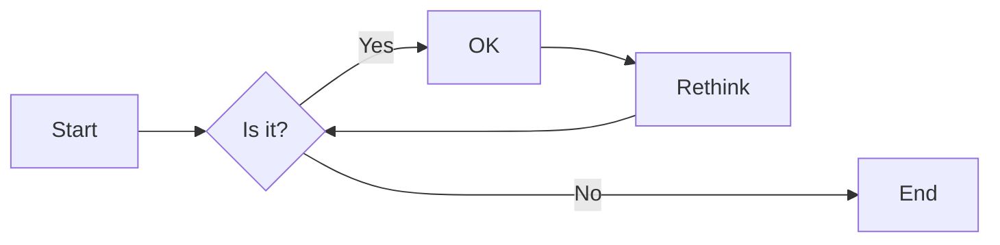
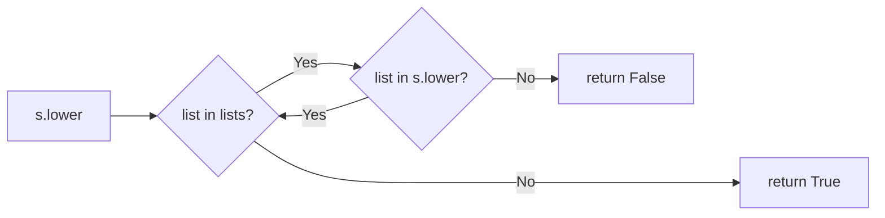

# 实验五 Python数据结构与数据模型

班级： 21计科03

学号： B20210302317

姓名：覃思敏

Github地址：<https://github.com/xx12qq/Experiment.git>

CodeWars地址：<https://www.codewars.com/users/xx12qq>

---

## 实验目的

1. 学习Python数据结构的高级用法
2. 学习Python的数据模型

## 实验环境

1. Git
2. Python 3.10
3. VSCode
4. VSCode插件

## 实验内容和步骤

### 第一部分

在[Codewars网站](https://www.codewars.com)注册账号，完成下列Kata挑战：

---

#### 第一题：停止逆转我的单词

难度： 6kyu

编写一个函数，接收一个或多个单词的字符串，并返回相同的字符串，但所有5个或更多的字母单词都是相反的（就像这个Kata的名字一样）。传入的字符串将只由字母和空格组成。只有当出现一个以上的单词时，才会包括空格。
例如：

```python
spinWords( "Hey fellow warriors" ) => returns "Hey wollef sroirraw" 
spinWords( "This is a test") => returns "This is a test" 
spinWords( "This is another test" )=> returns "This is rehtona test"
```

代码提交地址：
<https://www.codewars.com/kata/5264d2b162488dc400000001>

提示：

- 利用str的split方法可以将字符串分为单词列表
例如：

```python
words = "hey fellow warrior".split()
# words should be ['hey', 'fellow', 'warrior']
```

- 利用列表推导将长度大于等于5的单词反转(利用切片word[::-1])
- 最后使用str的join方法连结列表中的单词。

---

#### 第二题： 发现离群的数(Find The Parity Outlier)

难度：6kyu

给你一个包含整数的数组（其长度至少为3，但可能非常大）。该数组要么完全由奇数组成，要么完全由偶数组成，除了一个整数N。请写一个方法，以该数组为参数，返回这个 "离群 "的N。

例如：

```python
[2, 4, 0, 100, 4, 11, 2602, 36]
# Should return: 11 (the only odd number)

[160, 3, 1719, 19, 11, 13, -21]
# Should return: 160 (the only even number)
```

代码提交地址：
<https://www.codewars.com/kata/5526fc09a1bbd946250002dc>

---

#### 第三题： 检测Pangram

难度：6kyu

pangram是一个至少包含每个字母一次的句子。例如，"The quick brown fox jumps over the lazy dog "这个句子就是一个pangram，因为它至少使用了一次字母A-Z（大小写不相关）。

给定一个字符串，检测它是否是一个pangram。如果是则返回`True`，如果不是则返回`False`。忽略数字和标点符号。
代码提交地址：
<https://www.codewars.com/kata/545cedaa9943f7fe7b000048>

---

#### 第四题： 数独解决方案验证

难度：6kyu

数独背景

数独是一种在 9x9 网格上进行的游戏。游戏的目标是用 1 到 9 的数字填充网格的所有单元格，以便每一列、每一行和九个 3x3 子网格（也称为块）中的都包含数字 1 到 9。更多信息请访问：<http://en.wikipedia.org/wiki/Sudoku>

编写一个函数接受一个代表数独板的二维数组，如果它是一个有效的解决方案则返回 true，否则返回 false。数独板的单元格也可能包含 0，这将代表空单元格。包含一个或多个零的棋盘被认为是无效的解决方案。棋盘总是 9 x 9 格，每个格只包含 0 到 9 之间的整数。

代码提交地址：
<https://www.codewars.com/kata/63d1bac72de941033dbf87ae>

---

#### 第五题： 疯狂的彩色三角形

难度： 2kyu

一个彩色的三角形是由一排颜色组成的，每一排都是红色、绿色或蓝色。连续的几行，每一行都比上一行少一种颜色，是通过考虑前一行中的两个相接触的颜色而产生的。如果这些颜色是相同的，那么新的一行就使用相同的颜色。如果它们不同，则在新的一行中使用缺失的颜色。这个过程一直持续到最后一行，只有一种颜色被生成。

例如：
```python
Colour here:            G G        B G        R G        B R
Becomes colour here:     G          R          B          G
```


一个更大的三角形例子：

```python
R R G B R G B B
 R B R G B R B
  G G B R G G
   G R G B G
    B B R R
     B G R
      R B
       G
```

你将得到三角形的第一行字符串，你的工作是返回最后的颜色，这将出现在最下面一行的字符串。在上面的例子中，你将得到 "RRGBRGBB"，你应该返回 "G"。
限制条件： 1 <= length(row) <= 10 ** 5
输入的字符串将只包含大写字母'B'、'G'或'R'。

例如：

```python
triangle('B') == 'B'
triangle('GB') == 'R'
triangle('RRR') == 'R'
triangle('RGBG') == 'B'
triangle('RBRGBRB') == 'G'
triangle('RBRGBRBGGRRRBGBBBGG') == 'G'
```

代码提交地址：
<https://www.codewars.com/kata/5a331ea7ee1aae8f24000175>

提示：请参考下面的链接，利用三进制的特点来进行计算。
<https://stackoverflow.com/questions/53585022/three-colors-triangles>

---

### 第二部分

使用Mermaid绘制程序流程图

安装VSCode插件：

- Markdown Preview Mermaid Support
- Mermaid Markdown Syntax Highlighting

使用Markdown语法绘制你的程序绘制程序流程图（至少一个），Markdown代码如下：


显示效果如下：



查看Mermaid流程图语法-->[点击这里](https://mermaid.js.org/syntax/flowchart.html)

使用Markdown编辑器（例如VScode）编写本次实验的实验报告，包括[实验过程与结果](#实验过程与结果)、[实验考查](#实验考查)和[实验总结](#实验总结)，并将其导出为 **PDF格式** 来提交。

## 实验过程与结果

请将实验过程与结果放在这里，包括：

- [第一部分 Codewars Kata挑战](#第一部分)
  1. 第一题：停止逆转我的单词  
   （1） 实验代码：

    ```python
    def spin_words(sentence):
    # Your code goes here
    lists=sentence.split()#字符串按空格分开
    ret=[]
    
    for list in lists:
        if len(list)>=5:
            ret.append(''.join(reversed(list)))
        else:
            ret.append(list)
        ret.append(' ')
    ret.pop()
    return ''.join(ret)
    #测试用例
    spin_words("Hey fellow warriors")
    spin_words("This sentence is a sentence")
    ```

   （2） 实验结果：  
   'This ecnetnes is a ecnetnes'  
  2. 第二题： 发现离群的数(Find The Parity Outlier)  
   （1） 实验代码：

   ```python
   def find_outlier(integers):
    lists1=[integer for integer in integers if integer%2==0]
    lists2=[integer for integer in integers if integer%2!=0]
    if len(lists1)>len(lists2):
        return lists2[0]
    else:
        return lists1[0]
    #测试用例
    print(find_outlier([160, 3, 1719, 19, 11, 13, -21]))
    print(find_outlier([2, 4, 6, 8, 10, 3]))
   ```

   （2） 实验结果：  
   160  
    3  
  3. 第三题： 检测Pangram  
   （1）实验代码：

   ```python
   def is_pangram(s):
    s=s.lower()
    lists=['a','b','c','d','e','f','g','h','i','j','k','l',
        'm','n','o','p','q','r','s','t','u','v','w','x','y','z']
    for list in lists:
        if list not in s:
            return False
    return True
    #测试用例
    print(is_pangram("The quick, brown fox jumps over the lazy dog!"))
    print(is_pangram("1bcdefghijklmnopqrstuvwxyz"))
   ```

   （2）实验结果：  
   True  
    False  
  4. 第四题： 数独解决方案验证  
    （1） 实验代码：

    ```python
    def validate_sudoku(board):
    lists1={1,2,3,4,5,6,7,8,9}

    lists2=list(zip(*board))
    #print(lists2)
    for lists in board:
        if set(lists) != lists1:
            return False
    for lists in lists2:
        if set(lists) != lists1:
            return False
    #检查每个 3x3 子方格
    for i in range(0,9,3):
        for j in range(0,9,3):
            list3=[board[x][y] for x in range(i,i+3) for y in range(j,j+3)]
            if set(list3) != lists1:
                return False
    return True
    #测试用例
    #测试用例
    validate_sudoku([[1,2,3,4,5,6,7,8,9],
                [1,2,3,4,5,6,7,8,9],
                [1,2,3,4,5,6,7,8,9],
                [1,2,3,4,5,6,7,8,9],
                [1,2,3,4,5,6,7,8,9],
                [1,2,3,4,5,6,7,8,9],
                [1,2,3,4,5,6,7,8,9],
                [1,2,3,4,5,6,7,8,9],
                [1,2,3,4,5,6,7,8,9]])
    ```

   （2） 实验结果：  
   False  
  5. 第五题： 疯狂的彩色三角形  
   （1） 实验代码：

   ```python
   def triangle(row):
        powers_of_3 = list(reversed([3**i+1 for i in range(10) if (3**i)<=100000]))
        # 找到小于100000的所有的3的幂加1，从大到小排序
        #print(powers_of_3)
        color = {'GG':'G', 'BB':'B', 'RR':'R', 'BR':'G', 
        'BG':'R', 'GB':'R', 'GR':'B', 'RG':'B', 'RB':'G'}
        for x in powers_of_3:
                while len(row)>=x:
                        row=[color[row[i]+row[x+i-1]] for i in range(len(row)-x+1)]

        return row[0]
        basic_cases = [
        'B',
        'GB',
        'RRR',
        'RGBG',
        'RBRGBRB', 
        'RBRGBRBGGRRRBGBBBGG'
    ]
    for basic_case in basic_cases:
        print(basic_case+':'+triangle(basic_case))
   ```

   （2） 实验结果：  
    B:B  
    GB:R  
    RRR:R  
    RGBG:B  
    RBRGBRB:G  
    RBRGBRBGGRRRBGBBBGG:G

- [第二部分 使用Mermaid绘制程序流程图](#第二部分)



## 实验考查

请使用自己的语言并使用尽量简短代码示例回答下面的问题，这些问题将在实验检查时用于提问和答辩以及实际的操作。

1. 集合（set）类型有什么特点？它和列表（list）类型有什么区别？  
   答：集合的特点：合内的元素是唯一的，不会有重复的元素；集合是无序的；集合可以进行并集、交集、差集等集合运算  
   集合和列表的区别：集合是无序的，列表是有序的；集合中的元素不能重复，列表中的元素可以重复；集合中的元素是唯一的，列表中的元素可以重复。  
2. 集合（set）类型主要有那些操作？  
   答：并集、交集、差集、添加、删除、测试元素是否在集合中等操作
3. 使用`*`操作符作用到列表上会产生什么效果？为什么不能使用`*`操作符作用到嵌套的列表上？使用简单的代码示例说明。  
   答：（1）`*`操作符用于复制列表。（2）因为*操作符在应用到嵌套列表时，它的行为取决于操作符右侧的对象。如果右侧的对象是一个列表，那么*将复制这个列表中的元素。如果右侧的对象是整数，那么*将重复这个列表。由于嵌套列表的结构复杂，Python不知道应该如何复制它。例如：

   ```python
    nested_list = [[1, 2, 3], [4, 5, 6]]  
    nested_list_copy = nested_list * 2  # 这将会产生错误
   ```  

4. 总结列表,集合，字典的解析（comprehension）的使用方法。使用简单的代码示例说明。  
   答：(1)列表的解析的使用方法：[expression for item in list if conditional]

   ```python
    squares = [x**2 for x in range(1, 11)]  
    print(squares)  # 输出：[1, 4, 9, 16, 25, 36, 49, 64, 81, 100]
   ```

   （2）集合的解析的使用方法：{expression for item in list if conditional}

   ```python
    s = {x for x in range(1, 11)}  
    print(s)  # 输出：{0, 1, 2, 3, 4, 5, 6, 7, 8, 9}
   ```

   （3）字典的解析的使用方法：{key: value for item in list if conditional}

   ```python
   d = {x: x**2 for x in range(1, 11) if x % 2 == 0}  
    print(d)  # 输出：{2: 4, 4: 16, 6: 36, 8: 64, 10: 100}
   ```

## 实验总结


在这次实验中，我学到了以下知识：

编程工具的使用：

了解了编程工具如何运行和执行代码。
学会了在特定的编程环境中编辑、运行和调试代码。
数据结构：

掌握了列表（List）、集合（Set）等常见的数据结构。
了解了这些数据结构的特点、用途和基本操作。
程序语言的语法：

学习了 Python 编程语言的基本语法，包括变量、条件语句、循环等。
理解了 Python 的数据类型、函数、模块等概念。
算法：

熟悉了一些简单的算法，如求解异常值、解决彩色三角形问题等。
了解了算法的设计思路，通过编写代码解决具体问题。
编程技巧：

学习了编程中的一些常见技巧，如使用列表解析、集合解析等。
掌握了通过编写函数来组织和复用代码的方法。
编程思想：

培养了解决问题的编程思维，学会将问题分解为小的可解决部分。
强调了代码的可读性、简洁性和模块化，以提高代码的维护性和可理解性。